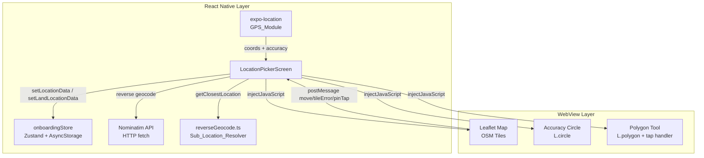

# Design Document: Maps & Location

## Overview

This document describes the technical design for the Maps & Location feature improvements in the Tanak Prabha React Native/Expo app. The feature centres on `(auth)/location-picker.tsx` — a full-screen Leaflet WebView map that lets farmers pin their home location or land parcel boundary during onboarding and from their profile.

The improvements cover eight areas: GPS accuracy visualisation, offline resilience, land parcel polygon capture, accuracy threshold warnings, search UX, "My Location" reliability, address pre-population quality, and the root-level route alias. The underlying map stack (OSM tiles, Leaflet, Nominatim) is unchanged.

### Scope boundaries

| In scope | Out of scope |
|---|---|
| `(auth)/location-picker.tsx` | Google Maps migration |
| `utils/reverseGeocode.ts` | Server-side geocoding |
| `stores/onboardingStore.ts` (schema only) | Backend polygon storage |
| `app/location-picker.tsx` (alias comment) | Other onboarding screens |

---

## Architecture

The location picker is a single React Native screen that embeds a Leaflet map inside a `react-native-webview`. All map rendering, tile loading, and polygon drawing happen inside the WebView's HTML/JS context. The React Native layer owns state, GPS acquisition, Nominatim HTTP calls, and persistence.



### Communication protocol (RN ↔ WebView)

All messages are JSON strings passed through `window.ReactNativeWebView.postMessage` (WebView → RN) and `webViewRef.current.injectJavaScript` (RN → WebView).

**WebView → RN message types:**

| `type` | Payload | Trigger |
|---|---|---|
| `move` | `{ lat, lng }` | Map centre changes (throttled 250 ms) |
| `tileError` | `{}` | OSM tile load fails |
| `tileOk` | `{}` | Tile loads successfully after prior failure |
| `pinTap` | `{ index: number }` | User taps a polygon boundary pin |
| `mapTap` | `{ lat, lng }` | User taps the map in Land_Flow polygon mode |

**RN → WebView injected functions:**

| Function | Purpose |
|---|---|
| `flyTo(lat, lng, zoom)` | Animate map to coordinates |
| `setAccuracyCircle(lat, lng, radiusM)` | Show/hide accuracy circle |
| `hideAccuracyCircle()` | Hide circle on drag |
| `addPolygonPin(lat, lng)` | Add a boundary pin |
| `removePolygonPin(index)` | Remove a boundary pin by index |
| `resetPolygon()` | Clear all polygon pins |

---

## Components and Interfaces

### LocationPickerScreen (updated state)

New state fields added to the existing component:

```ts
// Accuracy indicator
const [accuracyCircleVisible, setAccuracyCircleVisible] = useState(false);

// Offline / tile state
const [tilesOffline, setTilesOffline] = useState(false);

// Polygon (Land_Flow only)
const [polygonPins, setPolygonPins] = useState<Array<{ lat: number; lng: number }>>([]);

// My Location re-acquisition
const [myLocationLoading, setMyLocationLoading] = useState(false);
const [myLocationError, setMyLocationError] = useState<string | null>(null);
```

### Exported pure functions

These functions are extracted from inline logic and exported so property-based tests can import them directly:

```ts
// location-picker.tsx
export function formatAccuracyLabel(accuracyM: number): string
export function shouldWarn(accuracyM: number, thresholdM: number): boolean
export function truncate(s: string, maxLen: number): string
export function extractPrimaryName(displayName: string): string
export function extractSubtitle(address: NominatimAddress): string

// reverseGeocode.ts
export function haversineDistanceKm(lat1: number, lng1: number, lat2: number, lng2: number): number
export function computePolygonAreaHectares(vertices: Array<{ lat: number; lng: number }>): number
```

`NominatimAddress` is a local interface:

```ts
interface NominatimAddress {
  state_district?: string;
  county?: string;
  state?: string;
  [key: string]: string | undefined;
}
```

### Constants (location-picker.tsx)

```ts
const GPS_ACQUISITION_TIMEOUT_MS = 10_000;   // renamed from GPS_TIMEOUT_MS
const GPS_ACCURACY_THRESHOLD_M   = 100;       // new
const POLYGON_MAX_PINS           = 20;        // new
const SEARCH_PRIMARY_MAX_LEN     = 40;        // new
const SEARCH_SUBTITLE_MAX_LEN    = 60;        // new
```

### Leaflet HTML additions

The `buildLeafletHTML` function gains three new capabilities injected into the `<script>` block:

**1. Accuracy circle**
```js
var accuracyCircle = null;
window.setAccuracyCircle = function(lat, lng, radiusM) {
  if (accuracyCircle) map.removeLayer(accuracyCircle);
  accuracyCircle = L.circle([lat, lng], {
    radius: radiusM,
    color: '#386641', fillColor: '#386641', fillOpacity: 0.12, weight: 1.5
  }).addTo(map);
};
window.hideAccuracyCircle = function() {
  if (accuracyCircle) { map.removeLayer(accuracyCircle); accuracyCircle = null; }
};
```

**2. Tile error detection**
```js
tileLayer.on('tileerror', function() {
  window.ReactNativeWebView.postMessage(JSON.stringify({ type: 'tileError' }));
});
tileLayer.on('tileload', function() {
  window.ReactNativeWebView.postMessage(JSON.stringify({ type: 'tileOk' }));
});
```

**3. Polygon tool (Land_Flow)**
```js
var polygonPins = [];
var polygonLayer = null;
var pinMarkers = [];

window.addPolygonPin = function(lat, lng) {
  polygonPins.push([lat, lng]);
  var m = L.circleMarker([lat, lng], { radius: 8, color: '#D97706', fillColor: '#FBBF24', fillOpacity: 1 });
  m.on('click', function() {
    var idx = pinMarkers.indexOf(m);
    window.ReactNativeWebView.postMessage(JSON.stringify({ type: 'pinTap', index: idx }));
  });
  m.addTo(map);
  pinMarkers.push(m);
  _redrawPolygon();
};

window.removePolygonPin = function(index) {
  map.removeLayer(pinMarkers[index]);
  pinMarkers.splice(index, 1);
  polygonPins.splice(index, 1);
  _redrawPolygon();
};

window.resetPolygon = function() {
  pinMarkers.forEach(function(m) { map.removeLayer(m); });
  pinMarkers = []; polygonPins = [];
  if (polygonLayer) { map.removeLayer(polygonLayer); polygonLayer = null; }
};

function _redrawPolygon() {
  if (polygonLayer) { map.removeLayer(polygonLayer); polygonLayer = null; }
  if (polygonPins.length >= 3) {
    polygonLayer = L.polygon(polygonPins, { color: '#386641', fillOpacity: 0.2 }).addTo(map);
  }
}

// Tap-to-add in Land_Flow
map.on('click', function(e) {
  window.ReactNativeWebView.postMessage(
    JSON.stringify({ type: 'mapTap', lat: e.latlng.lat, lng: e.latlng.lng })
  );
});
```

The RN layer handles `mapTap` messages and calls `addPolygonPin` only when `polygonPins.length < POLYGON_MAX_PINS` and the screen is in Land_Flow.

---

## Data Models

### LocationData (updated)

```ts
// onboardingStore.ts
export interface LocationData {
  lat: number;
  lng: number;
  /** Human-readable address. "Unknown location" when geocoding failed. */
  address: string;
  /** GPS accuracy in metres at time of capture */
  accuracy: number;
  /** UTC ISO-8601 timestamp */
  setAt: string;
  /** "gps" = confirmed pin, "skipped" = user skipped */
  method: 'gps' | 'skipped';
  /**
   * Ordered boundary vertices for a land parcel polygon.
   * Only populated in Land_Flow when the user places >= 3 pins.
   * Undefined for home-location confirmations and single-pin land confirmations.
   * Backwards-compatible: existing AsyncStorage records without this field
   * deserialise as undefined (Zustand persist does not require all fields).
   */
  polygon?: Array<{ lat: number; lng: number }>;
}
```

### SearchResult (updated)

```ts
interface SearchResult {
  placeId: string;
  primaryName: string;   // extractPrimaryName(display_name)
  subtitle: string;      // extractSubtitle(address)
  lat: number;
  lng: number;
}
```

### Nominatim search query change

The forward search URL gains `addressdetails=1` so the structured `address` object is returned:

```
https://nominatim.openstreetmap.org/search
  ?q=<query>
  &format=json
  &limit=5
  &countrycodes=in
  &addressdetails=1        ← new
```

### getClosestLocation algorithm (reverseGeocode.ts)

The current implementation picks the first tehsil/block/village of the closest district. The updated algorithm does a two-pass haversine search at each level:

```
Pass 1: find closest district across all states
Pass 2: within that district, find closest tehsil by haversine (where coords exist)
Pass 3: within that tehsil, find closest block by haversine (where coords exist)
Pass 4: within that block, find closest village by haversine (where coords exist)
Fallback at each level: if no coordinate data, use first entry
```

`haversineDistanceKm` is extracted as a named export so it can be tested independently.

---

## Correctness Properties

*A property is a characteristic or behavior that should hold true across all valid executions of a system — essentially, a formal statement about what the system should do. Properties serve as the bridge between human-readable specifications and machine-verifiable correctness guarantees.*

### Property 1: Accuracy circle radius invariant

*For any* GPS accuracy value A (in metres, A >= 0), the radius passed to `L.circle` SHALL equal A. Formally: the value injected via `setAccuracyCircle(lat, lng, A)` uses `radius: A`.

**Validates: Requirements 1.1**

---

### Property 2: Accuracy label format

*For any* non-negative integer accuracy value A, `formatAccuracyLabel(A)` SHALL return the string `"±" + A + "m"`.

**Validates: Requirements 1.2**

---

### Property 3: Offline confirm produces valid LocationData

*For any* valid (lat, lng) pin where lat !== 0 or lng !== 0, when Nominatim geocoding fails, the confirmed `LocationData` object SHALL satisfy: `address === "Unknown location"` and `method === "gps"`.

**Validates: Requirements 2.4**

---

### Property 4: Polygon pin cap enforcement

*For any* sequence of N add-pin actions (N >= 0), the resulting `polygonPins` array SHALL have length `Math.min(N, 20)`. No add-pin action beyond the 20th shall change the array.

**Validates: Requirements 3.1, 3.2**

---

### Property 5: Polygon rendered iff pin count >= 3

*For any* `polygonPins` array of length N, a closed polygon SHALL be rendered in the WebView if and only if N >= 3. For N < 3, only individual pin markers are shown.

**Validates: Requirements 3.3, 3.4**

---

### Property 6: Polygon vertex round-trip serialisation

*For any* array of polygon vertices V (length >= 3), storing `landLocationData` with `polygon: V` to AsyncStorage via `onboardingStore` and then reading it back SHALL produce an array equal to V (same length, same lat/lng values to floating-point precision).

**Validates: Requirements 3.6**

---

### Property 7: Land parcel confirmation always sets method = "gps"

*For any* land parcel confirmation (any number of pins, online or offline), the stored `landLocationData.method` SHALL equal `"gps"`.

**Validates: Requirements 3.8**

---

### Property 8: Polygon area non-negativity

*For any* polygon with N >= 3 vertices, `computePolygonAreaHectares(vertices) >= 0`. For any polygon where all vertices are the same point, `computePolygonAreaHectares(vertices) === 0`.

**Validates: Requirements 3.9**

---

### Property 9: Accuracy threshold gate

*For any* accuracy value A >= 0 and threshold T > 0, `shouldWarn(A, T) === (A > T)`. The warning dialog is shown if and only if accuracy strictly exceeds the threshold.

**Validates: Requirements 4.1, 4.5**

---

### Property 10: Truncation idempotence and length bound

*For any* string S and max length N > 0:
- `truncate(truncate(S, N), N) === truncate(S, N)` (idempotent)
- `truncate(S, N).length <= N + 1` (the +1 accounts for the "…" character)

**Validates: Requirements 5.2, 5.3**

---

### Property 11: Primary name extraction round-trip

*For any* primary place name P that contains no commas, `extractPrimaryName(P + ", district, state") === P`. The function returns the first comma-separated segment, trimmed.

**Validates: Requirements 5.1**

---

### Property 12: Closest sub-location optimality

*For any* (lat, lng) within India's bounding box, the tehsil T returned by `getClosestLocation` SHALL satisfy: `haversineDistanceKm(lat, lng, T.lat, T.lng) <= haversineDistanceKm(lat, lng, T2.lat, T2.lng)` for all other tehsils T2 within the same closest district (where coordinate data exists).

**Validates: Requirements 7.1, 7.2**

---

### Property 13: Haversine metric correctness

*For any* coordinate pairs (lat1, lng1) and (lat2, lng2):
- Non-negativity: `haversineDistanceKm(lat1, lng1, lat2, lng2) >= 0`
- Symmetry: `haversineDistanceKm(lat1, lng1, lat2, lng2) === haversineDistanceKm(lat2, lng2, lat1, lng1)`
- Identity: `haversineDistanceKm(lat, lng, lat, lng) === 0`

**Validates: Requirements 7.1, 7.2**

---

## Error Handling

### GPS acquisition failures

| Scenario | Behaviour |
|---|---|
| Permission denied | Show permission-denied screen with "Enable in Settings" button |
| Timeout (> GPS_ACQUISITION_TIMEOUT_MS) | Set `gpsFallbackUsed = true`, show fallback banner, centre on India |
| Re-acquisition timeout (My Location button) | Show inline error "Could not get GPS location. Try moving to an open area." |
| Accuracy > GPS_ACCURACY_THRESHOLD_M | Show warning dialog before confirming |

### Network failures

| Scenario | Behaviour |
|---|---|
| OSM tile load failure | Show offline banner (non-blocking); polygon tool remains functional |
| Nominatim reverse geocode failure | Show "Address unavailable — you can still confirm your pin"; Confirm button stays enabled |
| Nominatim forward search failure | Clear results, hide dropdown; no error message shown (silent degradation) |
| Nominatim search returns empty | Show "No results found" in dropdown |

### Data edge cases

| Scenario | Behaviour |
|---|---|
| Polygon with < 3 pins confirmed | Store single centre pin; `polygon` field is `undefined` |
| Polygon with > 20 pins attempted | Cap at 20; show inline "Maximum 20 boundary points reached" |
| `getClosestLocation` distance > 500 km | Return empty strings for all fields |
| Sub-location level has no coordinate data | Fall back to first entry at that level |

---

## Testing Strategy

### Dual testing approach

Both unit tests and property-based tests are required. They are complementary:
- Unit tests catch concrete bugs at specific inputs and integration points.
- Property tests verify universal correctness across the full input space.

### Property-based testing

**Library**: `fast-check` (TypeScript-native, works in Jest/Vitest, no extra setup).

**Configuration**: Each property test runs a minimum of 100 iterations (`numRuns: 100`).

**Tag format**: Each test is tagged with a comment:
```
// Feature: maps-location, Property <N>: <property_text>
```

Each correctness property from the design document is implemented by exactly one property-based test.

**Property test file**: `Client/src/__tests__/maps-location.property.test.ts`

Example structure:
```ts
import fc from 'fast-check';
import { formatAccuracyLabel, shouldWarn, truncate, extractPrimaryName } from '../app/(auth)/location-picker';
import { haversineDistanceKm, computePolygonAreaHectares } from '../utils/reverseGeocode';

// Feature: maps-location, Property 2: Accuracy label format
test('formatAccuracyLabel returns ±Xm for any non-negative integer', () => {
  fc.assert(
    fc.property(fc.nat(), (a) => {
      expect(formatAccuracyLabel(a)).toBe(`±${a}m`);
    }),
    { numRuns: 100 }
  );
});

// Feature: maps-location, Property 9: Accuracy threshold gate
test('shouldWarn returns true iff accuracy > threshold', () => {
  fc.assert(
    fc.property(fc.float({ min: 0, max: 1000 }), fc.float({ min: 1, max: 1000 }), (a, t) => {
      expect(shouldWarn(a, t)).toBe(a > t);
    }),
    { numRuns: 100 }
  );
});

// Feature: maps-location, Property 10: Truncation idempotence and length bound
test('truncate is idempotent and respects length bound', () => {
  fc.assert(
    fc.property(fc.string(), fc.integer({ min: 1, max: 200 }), (s, n) => {
      const once = truncate(s, n);
      const twice = truncate(once, n);
      expect(once).toBe(twice);
      expect(once.length).toBeLessThanOrEqual(n + 1);
    }),
    { numRuns: 100 }
  );
});

// Feature: maps-location, Property 13: Haversine metric correctness
test('haversineDistanceKm satisfies non-negativity, symmetry, identity', () => {
  fc.assert(
    fc.property(
      fc.float({ min: -90, max: 90 }), fc.float({ min: -180, max: 180 }),
      fc.float({ min: -90, max: 90 }), fc.float({ min: -180, max: 180 }),
      (lat1, lng1, lat2, lng2) => {
        const d12 = haversineDistanceKm(lat1, lng1, lat2, lng2);
        const d21 = haversineDistanceKm(lat2, lng2, lat1, lng1);
        expect(d12).toBeGreaterThanOrEqual(0);
        expect(d12).toBeCloseTo(d21, 10);
        expect(haversineDistanceKm(lat1, lng1, lat1, lng1)).toBeCloseTo(0, 10);
      }
    ),
    { numRuns: 100 }
  );
});
```

### Unit tests

**File**: `Client/src/__tests__/maps-location.unit.test.ts`

Focus areas:
- Offline banner shown on `tileError` message, hidden on `tileOk`
- Confirm button enabled when geocode fails but pin exists (Req 2.3)
- Warning dialog shown/dismissed correctly (Req 4.2–4.4)
- "No results found" shown when search returns empty (Req 5.5)
- My Location re-acquisition success and failure paths (Req 6.1–6.6)
- `getClosestLocation` fallback when sub-location has no coordinates (Req 7.5)
- `getClosestLocation` returns empty strings when distance > 500 km (Req 7.6)
- Polygon reset clears all pins (Req 3.10)
- Single-pin land confirmation stores `polygon: undefined` (Req 3.7)

### Integration / smoke tests

- Navigate to `/(auth)/location-picker` and `/location-picker` — both should render the same component (Req 8.3)
- Confirm in onboarding home flow pre-populates `personalDetails` fields (Req 7)
- Confirm in Land_Flow with 3+ pins stores `polygon` array in `landLocationData` (Req 3.6)
